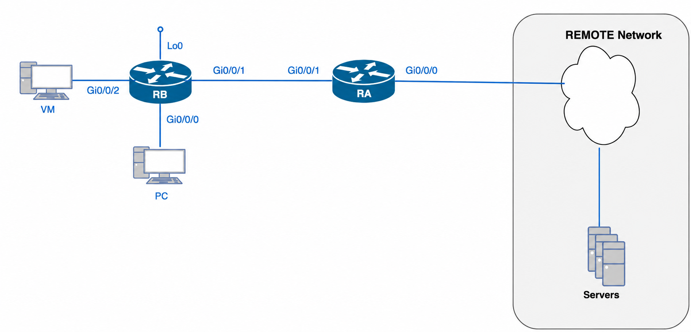

# Lab 12 — NAT Operation and Troubleshooting

---

## Section A — Start Here

### A1 — Overview

This lab is different from every lab before it. You are not building a NAT configuration from scratch — you are handed one.

Before you arrive, an automated provisioning tool (`day0_provision.py`) pushes a **pre-built NAT configuration** onto your CORE and EDGE routers over the console port. That configuration is deliberately incomplete: it contains **four injected faults**, each drawn from the "Common NAT Problems" category list covered in lecture (ACL mismatch, reversed inside/outside roles, wrong pool range, incorrect pool name, and related categories). Every fault is syntactically valid IOS — the push always completes cleanly. Nothing announces itself during provisioning; you only find these by actually auditing and testing the NAT configuration yourself.

Your job is not to configure NAT. Your job is to **prove what is broken, why it is broken, and how you know** — using the same operational evidence (`show ip nat translations`, `show ip nat statistics`, ACL hit counters) that a real network operator would use during an outage call.

> **The PC pool host and the server/VM host get their IP addresses via DHCP**, served by CORE. You do not statically configure IP settings on either end device — connect them to the pod, and CORE hands out an address automatically. You will still need to discover what address each one actually received (see C00).

> **This lab reuses the Lab 11 physical topology and addressing plan exactly.** The two routers, the transit link, the PC pool, the server/VM host, and the Remote tester are wired the same way and addressed the same way as Lab 11. Nothing about the IP plan has changed — only how it gets onto the routers has changed (pushed by tooling instead of typed by hand).

### A1.1 — Mini Quick-Ref

| Task | Command | Notes |
|---|---|---|
| Show live translations | `show ip nat translations` | EXEC mode. No output ≠ "NAT is broken" by itself — check statistics and ACL too. |
| Show NAT hit/miss counters and interface roles | `show ip nat statistics` | EXEC mode. This is where you catch reversed inside/outside roles and check pool allocation. |
| Clear the translation table before a test | `clear ip nat translation *` | Do this before every verification attempt so old entries don't confuse your evidence. |
| Show an ACL and its hit counts | `show ip access-lists <name-or-number>` | 0 hits after real traffic = the ACL isn't matching what you think it matches. |
| Show a NAT pool's configuration | `show ip nat pool <name>` | Confirms the pool's actual address range and whether it even exists under the name you expect. |
| Confirm interface addressing and status | `show ip interface brief` | Use this in C00 before you touch NAT at all. |
| Confirm the routed path to a destination | `show ip route` | Use this in C00, alongside `show ip interface brief`, to establish the addressing/routing baseline. |
| Confirm inside/outside role on one interface | `show ip interface <intf> \| include NAT` | Confirms which role IOS thinks that interface has. |
| Confirm what address DHCP handed an end device | `show ip dhcp binding` | Run on CORE. The PC pool host and server/VM host get their addresses this way — use this instead of asking the device itself. |
| Generate a translation attempt | Any tool available on the host: `ssh`, `curl`, `wget`, `ping`, `telnet` | You need live traffic to generate translation table entries — NAT does nothing to idle hosts. **The specific service does not matter** — you are proving whether the connection completes end to end, not exercising a particular protocol. |

### A1.2 — Evidence Collection

**C00** is collected automatically with `x_remote.py` against `l12-base.yaml` (see C00 below) — this captures the baseline addressing, SSH, routing, and DHCP binding state in one pass.

**C01–C04** use the same **manual evidence collection** convention as previous labs: copy device prompts and full command output into your submission file **as you complete each checkpoint** — not saved up and written from memory at the end. These checkpoints require before/after evidence around each fix, which a single static command run can't capture.

### A2 — Why This Lab Is Important

- **Translation success and network success are different questions.** A device can prove NAT is translating correctly and still fail to reach its destination for an unrelated reason (routing, ACL, DNS). Confusing these two failure modes is one of the most common real-world NAT support mistakes.
- **Diagnosis is a process, not a guess.** The 5-step troubleshooting sequence from lecture — traffic generated → selected for translation → resource available → translation occurring → return traffic allowed — gives you an ordered way to localize a fault instead of randomly re-typing configuration.
- **Evidence-based root cause beats trial-and-error.** In production networks you rarely get to "just reconfigure it and see" — you are expected to justify the fix with the smallest useful evidence set before you touch the device.
- **This mirrors real operational work.** NAT/PAT troubleshooting tickets ("customer can't reach X") are extremely common in enterprise and ISP environments; the discipline of separating "is it selected," "is it translating," and "is it routed" scales directly to that job.

### A3 — How to Audit Any NAT Rule

This is the method you will apply, from scratch, to the device and to each of the three NAT rules on EDGE. It is not specific to any one fault — it is how you would sanity-check *any* NAT configuration, broken or not:

1. **Select the device and interfaces participating.** Per policy, which interface is inside and which is outside? NAT cannot work at all if this is wrong.
2. **Select the traffic.** Check the ACL. Does it actually match the real subnet it's supposed to cover?
3. **Select the inside source.** Check the pool (or the interface, for PAT-to-exit-interface rules). Is the rule bound to the pool or interface you'd expect — the right name, the right range?
4. **Bind the traffic to be translated.** Check the binding: `show ip nat statistics`, ACL hit counters. Is anything actually being handed to the translation engine?
5. **Verify.** `show ip nat translations`, plus an actual connection attempt end to end. Does a matching entry appear, and does the connection itself complete?

Apply all five steps to **every rule** — don't stop at the first one that looks fine. A rule can pass steps 1–2 and still fail at step 3, or pass 1–4 and still fail step 5 for a reason that has nothing to do with NAT.

### A4 — Objectives / Evidence Map

This lab is organized as a baseline checkpoint plus four **trouble tickets** — short, realistic complaints. The first ticket covers the device/interface roles (A3 step 1); the remaining three each cover one of the three NAT rules on EDGE.

| Objective | Checkpoint |
|---|---|
| Establish and document the live network baseline before diagnosing anything | C00 |
| Trouble Ticket — nothing translates at all, on any subnet | C01 |
| Trouble Ticket — server/VM subnet can't reach anything outside the pod | C02 |
| Trouble Ticket — private network traffic isn't reaching the TFTP server | C03 |
| Trouble Ticket — PC pool users can't reach anything outside the pod | C04 |

### A5 — Grading

This lab is graded out of **15 points**:

| Checkpoint | Points |
|---|---|
| C00 — Baseline | 2 |
| C01 — Trouble Ticket (interface roles) | 1 |
| C02 — Trouble Ticket (server/VM) | 4 |
| C03 — Trouble Ticket (private loopback) | 4 |
| C04 — Trouble Ticket (PC pool) | 4 |
| **Total** | **15** |

---

## Section B — Topology and Addressing

### B1 — Topology



The diagram above shows **device roles and physical cabling only**; no IP addressing is included. This is intentional: you will discover and document the actual addressing yourself at checkpoint C00, from the live devices, the same way you would inherit an unfamiliar network in the field.

For orientation, the topology has:

- **CORE** — the inside router. Connects the PC pool network, the server/VM-host network, and a private loopback network to the rest of the pod.
- **EDGE** — the outside/public-facing router. Connects to the Remote tester (professor network) and carries all NAT configuration for this pod.
- **PC pool host** — an inside host used to test Trouble Ticket 3 (PC pool dynamic PAT pool rule). Gets its IP via **DHCP from CORE**.
- **Server/VM host** — an inside host used to test Trouble Ticket 1 (server/VM PAT-to-exit-interface rule). Gets its IP via **DHCP from CORE**.
- **Private loopback network** — lives entirely on CORE's own loopback interface; there is no separate physical host for it. Traffic for Trouble Ticket 2 is generated directly from CORE, sourced from that loopback address.
- **Remote tester** — external to the pod, standing in for "the Internet."

### B2 — Addressing Table

**Not provided here.** You will populate this table yourself at checkpoint C00 using live discovery commands. Do not guess or reuse addressing from memory of Lab 11 without confirming it against the live devices — confirming what is actually configured, rather than what you expect to be configured, is the point of C00.

| Network                  | Subnet | Discovered how?                            |
| ------------------------ | ------ | ------------------------------------------ |
| CORE–EDGE transit        |        | `show ip interface brief`, `show ip route` |
| PC pool network          |        | `show ip interface brief`, `show ip route` |
| Server/VM network        |        | `show ip interface brief`, `show ip route` |
| Private loopback network |        | `show ip interface brief`, `show ip route` |
| Remote/professor network |        | `show ip interface brief`, `show ip route` |

### B3 — Provisioning Requirements

| Item              | Requirement                                               |
| ----------------- | --------------------------------------------------------- |
| Provisioning tool | `day0_provision.py`,<br>[`day0-provision-guide.md`](../resources/day0-provision-guide.md) |
| Fault set         | Set 1 (`lab12-core.txt` / `lab12-edge.txt`)               |
| Push origin       | Your **native host OS** (Windows/Mac/Linux), **not** a VM |
| Post-push access  | SSH from Alpine, once CORE/EDGE have IPs                  |

### B4 — Intended NAT Design

You cannot recognize a deviation if you don't know what "correct" looks like. This is the **design intention** for NAT on EDGE — what a correctly working configuration would accomplish. It is not a copy of the live configuration, and it will not tell you which specific fault is present in your pod. Use it as the reference point you check the live device against in the trouble tickets (C01–C04), following the method in A3.

- **Device and interfaces (A3 step 1).** EDGE has one inside-facing interface (the transit link toward CORE) and one outside-facing interface (the link toward the Remote tester). The inside-facing interface should be marked `ip nat inside`, and the outside-facing interface should be marked `ip nat outside`.
- **NAT Rule 1 — PAT for the server/VM subnet.** Traffic from the server/VM network should be selected by an ACL that matches that subnet's real address range, then translated dynamically through the outside interface with PAT (`overload`) so the subnet's host can share the router's public address.
- **NAT Rule 2 — PAT for the private loopback network.** Traffic from the loopback network should be selected by an ACL that matches that subnet's real address range, then translated dynamically through a **named pool** whose address range falls inside the pod's actual assigned public block, with `overload`.
- **NAT Rule 3 — PAT for the PC pool network.** Traffic from the PC pool network should be selected by an ACL that matches that subnet's real address range, then translated dynamically through **its own, correctly named** pool — distinct from Rule 2's pool — with `overload`, so multiple PC pool hosts can share it.


---

## Section C — Lab Tasks and Evidence

### C00 — Cable the Pod, Provision the Baseline, and Establish the Network Baseline

#### Goal

Get the pre-built (faulted) NAT configuration onto both routers, then independently discover and document the live addressing and NAT state before diagnosing anything.

#### Why This Matters

You cannot reason about "what's broken" until you know "what's actually there." Skipping this step and diagnosing from memory or from the Lab 11 handout is exactly the trap this checkpoint is designed to catch — production networks are rarely handed to you with an accurate as-built diagram.

#### Action

1. **Cable the topology** per the physical diagram in B1.
2. **Set your PC's network settings** to the Remote/professor network (`203.0.113.U/24`, gateway `203.0.113.254`) — this is only so your PC itself can reach the TFTP server, independent of router state.
3. Download **`lab12.zip`** from the TFTP server to your **Desktop (Windows)**:
   ```powershell
   scp cisco@192.0.2.69:configs/lab12.zip Desktop\
   ```
   This one archive contains everything you need for provisioning: the templated device configs (`lab12-core-set1.cfg`, `lab12-edge-set1.cfg`), `day0_provision.py` and its support files, and `day0-lab12.yaml`. You are **not** hand-editing any of these files — `day0_provision.py` performs the placeholder substitution itself when it renders and pushes the configuration.
4. **Extract `lab12.zip` on your Desktop**, then follow **`day0-provision-guide.md`** to run the provisioning script for **both CORE and EDGE**. That guide covers installing requirements, finding the extracted folder, and the exact command to run — follow it now before continuing, then come back here.
5. Once both devices report a successful push (SSH reachable, expected interface address present), **switch to your Alpine VM over the network** for everything else — SSH-based diagnosis and all remaining checkpoints.
6. SSH into each device to confirm access:
   ```bash
   ssh admin@203.0.113.U    # EDGE — use your own U in place of the placeholder
   ssh admin@198.18.U.22    # CORE
   ```
   Credentials for both devices: username **admin**, password **cisco**. Once logged in, `enable` password **class**. (These are fixed, known credentials for this lab — not a secret you need to look up.)
7. Run discovery commands on **both** devices and fill in the addressing table in B2:
   ```text
   show ip interface brief
   show ip route
   ```
8. Confirm end-to-end reachability that does **not** depend on NAT (i.e., transit-link connectivity):
   ```bash
   ping <CORE transit address, from EDGE>
   ping <EDGE transit address, from CORE>
   ```
9. **Connect the PC pool host and the server/VM host.** These are reused from Lab 11 — if either one still has a **static** IP left over from that lab, change its network adapter setting to **obtain an IP address automatically (DHCP)** before continuing. CORE is now the DHCP server for both networks; you do not hand-configure an address on either device. From CORE, confirm what each one actually received:
   ```text
   show ip dhcp binding
   ```
   Record both addresses; you'll need them to generate traffic in C02 and C04.

#### Verification

```text
show ip interface brief
show ip route
```

```bash
ping <transit peer address>
```

```text
show ip dhcp binding
```

#### Success Indicator / Failure Signal

| Verification Item         | Success Indicator                                                                                      | Failure Signal                                                                                                                       |
| ------------------------- | ------------------------------------------------------------------------------------------------------ | ------------------------------------------------------------------------------------------------------------------------------------ |
| Push completion           | `day0_provision.py` reports both devices provisioned, verify checks pass                               | Push errors or verify checks fail                                                                                                    |
| Interface state           | Every configured interface shows **up, up** in `show ip interface brief`                               | Any interface shows `down` or `administratively down`                                                                                |
| SSH reachability          | Alpine can SSH to both CORE (`198.18.U.22`) and EDGE (`203.0.113.U`) with `admin/cisco`                | Connection refused/timeout, or credentials rejected                                                                                  |
| Addressing table (B2)     | Fully populated from live `show` output, matches what's actually configured                            | Table left blank, or filled from assumption instead of discovery                                                                     |
| Transit-link reachability | CORE and EDGE ping each other successfully                                                             | Ping fails (this would indicate a routing/addressing problem, which is out of scope for this fault set — flag it to your instructor) |
| DHCP bindings             | `show ip dhcp binding` on CORE shows a leased address for both the PC pool host and the server/VM host | One or both hosts missing from the binding table — check cabling and that the host is actually requesting DHCP                       |

#### Troubleshooting

If the push fails or SSH doesn't come up afterward: see the Troubleshooting section of `day0-provision-guide.md` in `resources/` before re-running the script.

If an end device has no DHCP binding: confirm it's cabled to the right port and set to obtain an address automatically — you are not assigning it a static IP.

#### C00 — Collection of Information

C00 is collected automatically — you are not hand-copying prompts for this checkpoint.

1. On your Alpine VM, get `l12-base.yaml` from the lab's `yaml/` folder (same place you got it for previous labs).
2. Open it and replace `{U}` and `{USERNAME}` with your own U number and username. It already targets CORE (`198.18.{U}.22`) and EDGE (`203.0.113.{U}`) with the `admin`/`cisco` credentials from C00 step 6, and it collects the interface, route, SSH, TCP, and DHCP binding evidence in one pass.
3. Run it:
   ```bash
   python x_remote.py l12-base.yaml
   ```
4. Confirm the run produced `l12-base-{username}.txt` with output for both CORE and EDGE, and that the DHCP binding output shows a leased address for the PC pool host and the server/VM host — you'll need both addresses for the trouble tickets below.

#### Sample Output Block

```bash
{username}-CORE# show ip interface brief | ex una|down
Interface              IP-Address      OK? Method Status                Protocol
GigabitEthernet0/0/0    10.17.18.1      YES manual up                    up
GigabitEthernet0/0/1    198.18.17.22    YES manual up                    up
GigabitEthernet0/0/2    172.16.9.33     YES manual up                    up
Loopback17              192.168.17.1    YES manual up                    up

{username}-CORE# show ip route | begin Gateway
Gateway of last resort is 198.18.17.17 to network 0.0.0.0
...

{username}-CORE# show ip ssh
SSH Enabled - version 2.0

{username}-CORE# show tcp brief
TCB     Local Address           Foreign Address        (state)

{username}-CORE# show ip dhcp binding
IP address       Client-ID/Hardware address   Lease expiration   Type
10.17.18.5       aabb.cc00.1001               ...                Automatic
172.16.9.6       aabb.cc00.2001                ...                Automatic

{username}-EDGE# show ip interface brief | ex una|down
Interface              IP-Address      OK? Method Status                Protocol
GigabitEthernet0/0/0    203.0.113.17    YES manual up                    up
GigabitEthernet0/0/1    198.18.17.17    YES manual up                    up

{username}-EDGE# show ip route | begin Gateway
Gateway of last resort is 203.0.113.254 to network 0.0.0.0
...

{username}-EDGE# show ip ssh
SSH Enabled - version 2.0

{username}-EDGE# show tcp brief
TCB     Local Address           Foreign Address        (state)
```

---

## Trouble Tickets

Each ticket below is a short complaint, the way it would actually arrive from a user or from monitoring. You don't get told which of the four fault categories is involved — apply the method in A3 (and B4's intended design, and your troubleshooting infographic) to find out, the same way you would on a real outage call. Work them in order — C02, C03, and C04 will all look identical ("nothing is selected") until C01 is confirmed correct.

**A note on protocols:** starting with C02, each ticket asks you to test with a specific protocol. This is deliberate — `show ip nat translations` shows a different port/protocol combination depending on what generated the entry, and reading that column correctly matters more as we move into extended ACLs next. Use the protocol specified; don't substitute your own.

---

### C01 — Trouble Ticket: Nothing Translates At All, On Any Subnet

#### Ticket

*"Verify nat router interface roles."*

#### Why This Matters

NAT depends entirely on IOS knowing which interface is "inside" and which is "outside" — everything else (ACL, pool, static mapping) is meaningless if the roles are swapped, because the router no longer knows which direction traffic is crossing the NAT boundary. This is the most structural possible problem: it isn't specific to any one subnet, so it breaks every rule identically, and it's the first thing to rule out before any of the other tickets will make sense.

#### Testing This Ticket

Review the interface roles in your nat router.

```
show ip nat statistics
```

#### Audit

Compare what IOS reports against the physical roles you discovered in C00 and the intention in B4.

#### Success Indicator / Failure Signal

| Verification Item | Success Indicator | Failure Signal |
|---|---|---|
| NAT statistics interface roles | Roles match the physical roles discovered in C00 and the intention in B4 | Roles swapped or missing |

#### C01 — Collection of Information

In `l12-{username}.txt`, create:

```text
=== C01 – Trouble Ticket: NAT Interface Roles ===
```

Include, before and after your fix:

```text
show ip nat statistics
```

Add a comment line stating what was wrong and what you changed, e.g.:

```text
!-- Gi0/0/0 and Gi0/0/1 NAT roles were reversed; corrected to match the physical inside/outside roles.
```

---

### C02 — Trouble Ticket: Server/VM Host Can't Reach Anything Outside the Pod

#### Ticket

*"The server/VM host has no external connectivity. Nothing it initiates outbound seems to work."*

#### Why This Matters

A NAT rule can be present and still never fire if the ACL selecting its traffic doesn't actually match the real subnet — nothing is ever handed to the translation engine. This is exactly what A3 steps 2–3 are for.

#### Testing This Ticket

Use **SSH (TCP)** for this one. From the **server/VM host** (the address you recorded in C00's DHCP binding), connect to the TFTP server:

```bash
ssh cisco@192.0.2.69
```

Then, from CORE, generate a second translation from a **different device** — its own server/VM-facing interface, which sits on the same subnet:

```text
{username}-CORE# ping 192.0.2.69 source GigabitEthernet0/0/2
```

You should end up with two distinct translation entries for this rule: one TCP (port 22), one ICMP — from two different source addresses.

#### Audit

Apply A3 steps 2–5 to this rule, using A1.1's evidence commands, B4's intended design, and your troubleshooting infographic. Clear the translation table before every re-test.

#### Success Indicator / Failure Signal

| Verification Item | Success Indicator | Failure Signal |
|---|---|---|
| ACL hit count | Non-zero after generating traffic | Stays at 0 |
| NAT translation table | Two entries appear — TCP/22 from the server/VM host, ICMP from CORE's Gi0/0/2 | No entries, or only one |
| Connection test | The SSH connection completes | Connection refused/times out despite a translation entry existing (if so, this points past NAT — flag it) |

#### C02 — Collection of Information

In `l12-{username}.txt`, create:

```text
=== C02 – Trouble Ticket: Server/VM PAT ===
```

Include, before and after your fix:

```text
show ip nat translations
show ip nat statistics
show access-list <the ACL number bound to this rule>
```

Plus the ping/SSH set described above (server/VM host and CORE-sourced).

Add a comment line stating what was wrong and what you changed, e.g.:

```text
!-- ACL <n> was matching the wrong subnet; corrected to the real server/VM range. Two translations confirmed (tcp/22, icmp).
```

---

### C03 — Trouble Ticket: Private Network Traffic Isn't Reaching the TFTP Server

#### Ticket

*"Monitoring reports backups from the private network never arrive. Something in that path isn't working."*

#### Why This Matters

A pool can exist, be correctly referenced, and still be wrong — if its address range doesn't fall inside the block actually assigned to this pod, translation will appear to succeed while the return path silently fails. This is a different failure shape than "no pool at all," and it's easy to miss if you only check that a pool *exists* rather than checking what's *in* it.

#### Testing This Ticket

There is no separate host for this network — the loopback address lives directly on CORE. Because there's only one device available here, use **two different protocols** instead of two different devices, both sourced from the loopback interface:

```text
{username}-CORE# ping 192.0.2.69 source Loopback{U}
{username}-CORE# telnet 192.0.2.69 80 /source-interface Loopback{U}
```

(The `telnet ... 80` is just a raw TCP reachability probe — you're not expecting a real HTTP session, only checking whether the TCP connection attempt itself completes.)

#### Audit

Apply A3 steps 2–5 to this rule. In particular, don't stop at confirming the pool referenced by the rule exists — use `show ip nat pool <name>` to check what range it actually covers, and compare that range against the pod's assigned public block documented in B4.

#### Success Indicator / Failure Signal

| Verification Item | Success Indicator | Failure Signal |
|---|---|---|
| ACL hit count | Non-zero after generating traffic | Stays at 0 |
| Pool range | Falls inside the pod's actual assigned public block | Pool's addresses belong to a block never assigned to this pod |
| Connection test | Both the ping and the TCP probe complete | Either times out despite a translation entry appearing to exist |

#### C03 — Collection of Information

In `l12-{username}.txt`, create:

```text
=== C03 – Trouble Ticket: Private Loopback PAT ===
```

Include, before and after your fix:

```text
show ip nat translations
show ip nat statistics
show ip nat pool <name>
show access-list <the ACL number bound to this rule>
```

Plus the ping and telnet probe from CORE sourced from `Loopback{U}` (two entries, ICMP and TCP/80).

Add a comment line stating what was wrong and what you changed, e.g.:

```text
!-- Pool <name> range didn't match the pod's assigned public block; corrected. Two translations confirmed (icmp, tcp/80).
```

---

### C04 — Trouble Ticket: PC Pool Users Can't Reach Anything Outside the Pod

#### Ticket

*"Multiple users on the PC pool network report no external connectivity."*

#### Why This Matters

A rule can reference a pool that genuinely exists — so IOS accepts the configuration without complaint — and still be pointed at the *wrong* pool. This doesn't look like a missing-resource problem or an ACL problem; it only shows up when you check which pool a rule is actually bound to, not just whether "a" pool is present.

#### Testing This Ticket

Use **TFTP (UDP)** for this one. From the **PC pool host** (the address you recorded in C00's DHCP binding), upload a file to the TFTP server — your evidence file works fine for this:

```text
tftp put l12-{username}.txt   (or your platform's TFTP client equivalent)
```

Then, from CORE, generate a second translation from a **different device** — its own PC-pool-facing interface:

```text
{username}-CORE# ping 192.0.2.69 source GigabitEthernet0/0/0
```

You should end up with two distinct translation entries: one UDP (port 69), one ICMP — from two different source addresses.

#### Audit

Apply A3 steps 2–5 to this rule. Specifically check **which pool name** this rule is bound to (`show running-config | section ip nat inside source list`) against the pool that's actually intended for the PC pool network per B4 — don't assume the rule is using the pool you'd expect just because a pool with a sensible name exists somewhere in the config.

#### Success Indicator / Failure Signal

| Verification Item | Success Indicator | Failure Signal |
|---|---|---|
| Pool binding | The rule references the pool actually intended for this network (B4) | The rule references a different, real pool |
| NAT translation table | Two entries appear — UDP/69 from the PC pool host, ICMP from CORE's Gi0/0/0 — both using the correct pool's range | No entries, or entries using the wrong pool's range |
| Connection test | The TFTP upload completes | Connection refused/times out |

#### C04 — Collection of Information

In `l12-{username}.txt`, create:

```text
=== C04 – Trouble Ticket: PC Pool PAT ===
```

Include, before and after your fix:

```text
show ip nat translations
show ip nat statistics
show ip nat pool <name>
show access-list <the ACL number bound to this rule>
```

Plus the TFTP upload and CORE-sourced ping set described above (two entries, UDP/69 and ICMP).

Add a comment line stating what was wrong and what you changed, e.g.:

```text
!-- Rule <n> was bound to the wrong pool; repointed to the correct one. Two translations confirmed (udp/69, icmp).
```

---

## Section D — Submission

### D1 — Submission Requirements

Submit two files:

```text
l12-base-{username}.txt
l12-{username}.txt
```

`l12-base-{username}.txt` is the `x_remote.py` output from C00. `l12-{username}.txt` contains the remaining four sections — `C01`, `C02`, `C03`, `C04` — each appended to the file as you complete that checkpoint, not written from memory at the end.

### D2 — Submit from PC

```bash
ssh cisco@192.0.2.69
ls -l /var/tftp/*{username}*
```

1. TFTP transfer completed.
2. Both `l12-base-{username}.txt` and `l12-{username}.txt` are present.
3. Both files have non-zero size.

Upload your corrected device configs to the TFTP server alongside your evidence file.

### D3 — Save Your Work and Clean Up Devices

After submission is confirmed, clean up routers using the provided TCL script.

```text
tclsh clean.tcl
```

- Turn off your router.
- Reload your switch (if applicable).
- Reboot your PC.

---

## End of Lab 12 — NAT Operation and Troubleshooting
