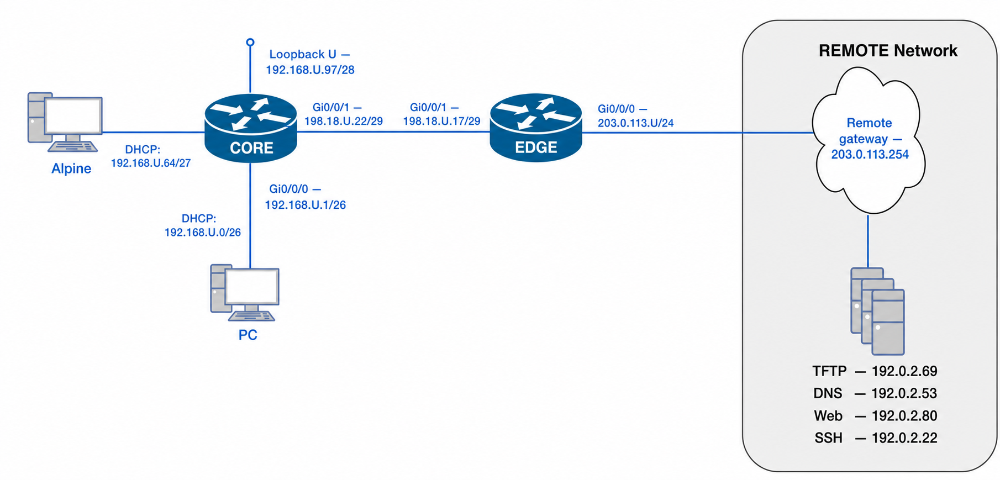

# Lab 13 — OSPF, NAT, and Extended ACLs: Full-Stack Policy on a Routed Edge

---

## Section A — Start Here

### A1 — Overview

This lab reuses the EDGE/CORE topology from Lab 11/12, with one change: all three inside networks now live inside a single block, `192.168.45.0/24`, carved by VLSM into a `/26`, a `/27`, and a `/28`. `day0_provision.py` pushes only the floor: addressing, NTP, DHCP for the PC and server/VM networks, and SSH. **OSPF and NAT are your work this lab, not the provisioner's** — you're building both from the ground up before layering three named extended ACLs on top.

This is deliberately a full-stack rebuild: routing, then translation, then filtering, each depending on the one before it working correctly. Nothing is handed to you pre-verified except basic reachability and addressing.

**Why the order matters, once you reach the ACLs:** extended ACLs and NAT both inspect addresses and ports, and on IOS the ACL is evaluated **before** the NAT translation lookup. Once you've proven NAT works at C02, any traffic a policy later blocks (C03–C05) is an ACL problem, not a NAT problem — check the ACL hit-counters first.

**This also inverts Lab 10's placement rule.** Standard ACLs (Lab 10) match only on source address, so you placed them close to the *destination* to avoid collaterally blocking unrelated traffic from the same source. Extended ACLs match on source, destination, protocol, and port all at once — they're precise enough to place close to the **source**, dropping unwanted traffic before it burns bandwidth crossing the network at all.

> **This lab does not carry forward.** Nothing after Lab 13 currently reuses this topology — clean up per Section D when you're done.

> **This lab runs very close to the structure of your Final SBA** — full-stack build, layered verification, evidence discipline. Take as many notes as you can as you go; you will want them later.

### A1.1 — Mini Quick-Ref

| Task | Command | Notes |
|---|---|---|
| OSPF process | `router ospf <id>` | |
| Set router-ID | `router-id <id>` | under `router ospf` |
| Originate default route | `default-information originate` | under `router ospf`, on the router with the actual default route |
| Set DR priority | `ip ospf priority <0-255>` | under `interface`; `0` = never DR |
| Set OSPF timers | `ip ospf hello-interval <n>` / `ip ospf dead-interval <n>` | under `interface`; must match on both ends of a link |
| Force point-to-point on a loopback | `ip ospf network point-to-point` | under `interface Loopback<n>` |
| Mark inside/outside for NAT | `ip nat inside` / `ip nat outside` | under the relevant `interface` |
| Summarize multiple subnets in one ACE | `access-list <n> permit <supernet> <wildcard>` | a wildcard covering the whole `/24` matches every host in every sub-block carved from it |
| PAT to a named pool | `ip nat pool <name> <start> <end> netmask <mask>` then `ip nat inside source list <ACL> pool <name> overload` | |
| Define a named extended ACL | `ip access-list extended [NAME]` | |
| Permit/deny by protocol, source, destination, port | `permit\|deny <protocol> <source> <src-wildcard> <dest> <dest-wildcard> [eq <port>]` | e.g. `deny udp <src> <wc> host 192.0.2.69 eq 69` |
| Match ICMP echo requests only (not replies) | `... echo` | `echo` = type 8 (request); replies (type 0) are unaffected |
| Apply ACL to an interface | `ip access-group [NAME] in\|out` | under `interface` config |
| Log every ACE match | append `log` to the ACE | check with `show logging \| include <ACL name>` |
| View ACL and hit counts | `show ip access-lists [NAME]` | EXEC mode |
| Check NAT is still translating | `show ip nat translations` / `show ip nat statistics` | run this **before** assuming a blocked flow is an ACL problem |

### A1.2 — Evidence Collection

- **C01** is collected automatically with `x_remote.py` against `l13-ospf.yaml` (provided in `lab13.zip`).
- **C02–C05** use manual evidence collection, the same convention as Lab 10/11: copy device prompts and full command output into the checkpoint's own file as you complete it.
- **Unlike earlier labs, each checkpoint from C02 onward gets its own evidence file** (`l13-nat-{username}.txt`, `l13-C03-{username}.txt`, `l13-C04-{username}.txt`, `l13-C05-{username}.txt`) and each is uploaded as soon as that checkpoint is done — see each checkpoint's Collection of Information for the exact timing.
- C00 is verified live at the terminal — no file is submitted for it.

### A2 — Why This Lab Is Important

- **Full-stack rebuild, not a single new skill.** OSPF, NAT, and extended ACLs have each been lab-tested individually. Rebuilding all three from scratch, in dependency order, on one topology is closer to what a real network deployment — or your SBA — actually asks of you.
- **Evaluation order is a common real-world misdiagnosis.** Engineers who don't know whether an ACL or NAT runs first on a given platform waste time troubleshooting the wrong subsystem during an outage.
- **Deny-then-permit-all is the dominant enterprise ACL pattern.** Enumerating every allowed flow doesn't scale; blocking a short list of known-bad flows and permitting the rest does.
- **Source-side placement is the other half of the ACL placement lesson.** Lab 10 taught destination-side placement for standard ACLs; this lab teaches when and why that flips.
- **Route summarization isn't just an OSPF concept.** The single NAT rule in this lab uses one ACE to match an entire `/24`, the same summarization logic you'd use in routing — a wildcard mask sized to the supernet automatically covers every sub-block carved from it.

### A3 — Objectives / Evidence Map

| Objective | Checkpoint |
|---|---|
| Confirm the day0-provisioned baseline — addressing, NTP, DHCP, SSH — is working before building anything on top | C00 |
| Build and verify OSPF between EDGE and CORE | C01 |
| Build and verify the single NAT rule covering all three inside networks | C02 |
| Design, place, and verify POLICY-VM (server/VM subnet, source-filtered) | C03 |
| Design, place, and verify POLICY-PC (PC subnet, source-filtered) | C04 |
| Design, place, and verify POLICY-EXTERNAL (inbound to EDGE's public interface, destination-filtered) | C05 |

### A5 — Grading

This lab is graded out of **15 points**, with up to **3 bonus points** available:

| Checkpoint | Points |
|---|---|
| C00 — Baseline (gate only, not scored) | 0 |
| C01 — OSPF | 3 |
| C02 — NAT | 3 |
| C03 — POLICY-VM | 3 |
| C04 — POLICY-PC | 3 |
| C05 — POLICY-EXTERNAL | 3 |
| **Base Total** | **15** |
| Bonus — syslog evidence captured for C03 | +1 |
| Bonus — syslog evidence captured for C04 | +1 |
| Bonus — syslog evidence captured for C05 | +1 |
| **Maximum possible** | **18** |

Every ACE in C03–C05 includes `log`. The bonus is earned by including matching `show logging` output — both a deny and a permit hit — in that checkpoint's evidence file. It's not required to pass the checkpoint; hit-counters alone are sufficient base-credit evidence, same as every other lab.

---

## Section B — Topology and Addressing

### B1 — Topology



### B2 — Addressing Table

All three inside networks are carved from a single block, `192.168.45.0/24`, by VLSM:

| Network                    | Block             | Mask              | Usable Range | Gateway                          |
| -------------------------- | ----------------- | ----------------- | ------------ | -------------------------------- |
| PC subnet                  | `192.168.45.0/26`  | `255.255.255.192` | `.1`–`.62`   | `192.168.45.1` (CORE Gi0/0/0)     |
| Server/VM subnet           | `192.168.45.64/27` | `255.255.255.224` | `.65`–`.94`  | `192.168.45.65` (CORE Gi0/0/2)    |
| Loopback (private network) | `192.168.45.96/28` | `255.255.255.240` | `.97`–`.110` | `192.168.45.97` (CORE Loopback U) |

| Device | Interface | IP Address (CIDR) | Description |
|---|---|---|---|
| **EDGE** | Gi0/0/0 | `203.0.113.45/24` | Outside interface to REMOTE — **does not participate in OSPF** |
| **EDGE** | Gi0/0/1 | `198.18.45.17/29` | OSPF neighbor to CORE |
| **CORE** | Gi0/0/0 | `192.168.45.1/26` | PC subnet gateway |
| **CORE** | Gi0/0/1 | `198.18.45.22/29` | OSPF neighbor to EDGE |
| **CORE** | Gi0/0/2 | `192.168.45.65/27` | Server/VM subnet gateway |
| **CORE** | Loopback U | `192.168.45.97/28` | Private loopback network |
| **PC** | — | DHCP from `192.168.45.0/26` | The PC subnet test host, served by CORE |
| **Alpine** | — | DHCP from `192.168.45.64/27` | The server/VM subnet test host, served by CORE. Also your usual SSH client VM — it plays both roles this lab. |
| **Remote** | — (gateway) | `203.0.113.254` | External tester |
| **TFTP server** | — | `192.0.2.69` | |
| **DNS server** | — | `192.0.2.53` | |
| **Web server** | — | `192.0.2.80` | |
| **SSH server** | — | `192.0.2.22` | |

### B3 — Baseline Requirements (Provisioned, Not Hand-Typed)

| Item              | Requirement                                                                            |
| ----------------- | -------------------------------------------------------------------------------------- |
| Provisioning tool | `day0_provision.py`, [`day0-provision-guide.md`](../resources/day0-provision-guide.md) |
| Config pushed     | `day0-lab13.yaml` — addressing, default route on EDGE, NTP, DHCP, SSH only             |
| Push origin       | Your **native host OS** (Windows/Mac/Linux), **not** a VM                              |
| Credentials       | username `admin`, password `cisco`; `enable` password `class`                          |
| NOT included      | OSPF and NAT — both are your work at C01 and C02                                       |
| Post-push access  | SSH from Alpine, device to device via the directly-connected transit link              |

### B4 — OSPF Requirements (Your Work — C01)

| Item | Requirement |
|---|---|
| Process ID | `45` |
| Router-IDs | EDGE = `45.0.0.17`, CORE = `45.0.0.22` |
| Default route | Originated on EDGE (`default-information originate`), advertised via OSPF so CORE learns `0.0.0.0/0` |
| DR election | **EDGE** wins on the transit link (interface priority `45` on EDGE's Gi0/0/1) |
| Passive interfaces | All interfaces not directly connected to an OSPF neighbor<br>Explicitly include CORE's `Loopback U` in the passive set |
| Excluded from OSPF | EDGE's `Gi0/0/0` (outside/public interface) — not declared in the OSPF process at all, not even as passive |
| Reference bandwidth | `10000 Mbps` on both routers |
| Convergence tuning | Transit link (`198.18.45.16/29`) uses `hello 5`/`dead 20`, matching on both ends<br>CORE's `Loopback U` uses OSPF network type `point-to-point`<br>CORE's PC- and server/VM-facing interfaces never become DR (priority `0`) |

### B5 — Intended NAT Design (Your Work — C02)

This lab uses **one NAT rule** covering all three inside networks at once — a single summarized ACE, the same way you'd summarize routes:

| Item        | Value                                                                                                                                                                                                 |
| ----------- | ----------------------------------------------------------------------------------------------------------------------------------------------------------------------------------------------------- |
| ACL         | Numbered `45` (standard), **one ACE**: `permit 192.168.45.0 0.0.0.255` — matches the whole `/24`, so it automatically covers the PC, server/VM, and loopback sub-blocks without listing them separately |
| Pool name   | `{username}-POOL` — literally your own username, not a placeholder                                                                                                                                    |
| Pool range  | The **first 6 usable addresses** of `209.10.45.0/28` — calculate this yourself. |
| Pool mask   | `255.255.255.240` (`/28`) — matches the pod's actual assigned block, even though only 6 of its 14 usable addresses go in this pool. Don't narrow it to a `/29`; that would describe a smaller allocation that was never actually carved out. |
| Translation | `ip nat inside source list U pool {username}-POOL overload`                                                                                                                                           |

All NAT configuration lives on EDGE; CORE carries no NAT commands.

---

## Section C — Lab Tasks and Evidence

### C00 — Provision the Baseline and Confirm It's Stable

#### Goal

Get the addressing/NTP/DHCP/SSH baseline onto both routers and confirm it's solid before building OSPF on top of it.

#### Why This Matters

If addressing or DHCP is wrong at this stage, every checkpoint after it — OSPF neighbors, NAT translations, ACL tests — becomes impossible to diagnose cleanly. Confirm the floor before building on it.

#### Action

1. **Cable the topology** — EDGE and CORE, transit link between them, PC and Alpine each on their own network.
2. Download and extract **`lab13.zip`** from the TFTP server to your Desktop — this creates a `lab13\` folder containing `day0_provision.py`, its templates, `day0-lab13.yaml`, and `l13-ospf.yaml`:
   ```powershell
   scp cisco@192.0.2.69:configs/lab13.zip Desktop\
   ```
3. Follow [`day0-provision-guide.md`](../resources/day0-provision-guide.md) to provision **both EDGE and CORE** with `day0-lab13.yaml`. Console into each device in turn; move the cable between pushes.
4. **Connect PC and Alpine**, both set to obtain an address automatically (DHCP). Confirm what each received:
   ```text
   CORE# show ip dhcp binding
   ```
   Record both addresses — you'll need them for later checkpoints.
5. SSH into both devices to confirm access:
   ```bash
   ssh admin@203.0.113.45    # EDGE
   ssh admin@198.18.45.22    # CORE — reachable directly over the transit link, no routing protocol needed yet
   ```

#### Verification

```text
show ip interface brief
show ntp associations
show ip dhcp binding
```

#### Success Indicator / Failure Signal

| Verification Item | Success Indicator | Failure Signal |
|---|---|---|
| Interface state | Every configured interface `up/up` | Any interface down |
| SSH reachability | Both devices reachable with `admin/cisco` | Refused/timeout |
| DHCP bindings | Both end hosts leased | Either missing |
| NTP | CORE synchronized to EDGE (stratum 5) | Not synchronized |

#### Troubleshooting

If a push fails or SSH doesn't come up: see the Troubleshooting section of [`day0-provision-guide.md`](../resources/day0-provision-guide.md) before re-running.

**C00 — Collection of Information: not required.** Do not continue until every item above passes.

---

### C01 — Build and Verify OSPF

#### Goal

Bring up OSPF between EDGE and CORE per the requirements in B4, so CORE learns a default route and every downstream checkpoint has full reachability to work with.

#### Verification

```text
show ip ospf neighbor
show ip protocols
show ip route ospf
show ip ospf interface brief
show ip ospf interface GigabitEthernet0/0/1 | include Priority|Timer
show ip ospf interface GigabitEthernet0/0/0
```

The last command runs on **EDGE**, targeting the interface that's deliberately excluded from OSPF. Expect **no output at all** — IOS prints nothing for `show ip ospf interface <if>` when that interface isn't part of any OSPF process. That silence is the evidence, not an error.

#### Success Indicator / Failure Signal

| Verification Item | Success Indicator | Failure Signal |
|---|---|---|
| Adjacency | EDGE/CORE, state `FULL` | Missing or stuck at `INIT`/`EXSTART` |
| Router-ID | Matches B4 | Auto-selected |
| DR | EDGE wins on the transit link | Wrong device elected |
| Default route | `0.0.0.0/0` on CORE via OSPF | Missing |
| Passive interfaces | All non-neighbor interfaces marked passive, including `Loopback U` | Any active unnecessarily, or loopback left non-passive |
| EDGE Gi0/0/0 | `show ip ospf interface GigabitEthernet0/0/0` on EDGE returns nothing | Any output at all — even a passive listing means it's still in the process |
| Timers | `hello 5`/`dead 20` on both ends of the transit link | Mismatched or default values |

#### Troubleshooting

If the neighbor is missing or stuck: check interface status, area number, process ID, and that router-IDs are actually unique.

If the default route doesn't appear on CORE: confirm EDGE actually has `ip route 0.0.0.0 0.0.0.0 203.0.113.254` (part of the baseline) before `default-information originate` has anything to originate.

If EDGE unexpectedly loses DR to CORE: double-check the priority is set on EDGE's Gi0/0/1, not CORE's — it's easy to configure the old Lab 11 winner out of habit.

#### C01 — Collection of Information (Automated)

Once OSPF is fully verified, collect evidence with `x_remote.py`. Run this from inside the `lab13\` folder you already `cd`'d into per [`day0-provision-guide.md`](../resources/day0-provision-guide.md) — the config file is in your current directory, not a subfolder of it:

1. Open `l13-ospf.yaml` and replace `{U}` and `{USERNAME}` with your own information.
2. Run:
   ```bash
   python x_remote.py l13-ospf.yaml
   ```
3. This produces `l13-ospf-{USERNAME}.txt`.

> **Hold this file.** PC and Alpine only have private addressing, so neither can reach the TFTP server yet — that path doesn't exist until C02's NAT rule is configured. You'll upload `l13-ospf-{USERNAME}.txt` together with C02's evidence file once NAT gives you a way out.

---

### C02 — Build and Verify NAT

#### Goal

Configure the single NAT rule from B5 on EDGE. Its one summarized ACE covers all three inside sub-blocks by design, but this checkpoint's test traffic only exercises the PC and server/VM subnets — the two with live hosts on them. The loopback sub-block's coverage is confirmed by inspecting the ACL/config (its wildcard matches the whole `/24`), not by a traffic test, since nothing in this lab originates traffic from that subnet.

#### Why This Matters

This is the last checkpoint before ACLs enter the picture — get NAT fully proven now, using each of the specific services the ACLs will later restrict, so that anything blocked at C03–C05 can be diagnosed as an ACL problem with confidence, not second-guessed as a NAT problem.

#### Verification

Generate these eight flows. The first six are the specific services the ACLs will restrict later; the last two are plain reachability checks:

| # | From | Test | Command |
|---|---|---|---|
| 1 | Alpine | TFTP to the TFTP server | `tftp -p -l <any file> 192.0.2.69` |
| 2 | Alpine | SSH to the SSH server | `ssh admin@192.0.2.22` |
| 3 | Alpine | HTTP to the web server | `curl http://192.0.2.80` (or `wget`) |
| 4 | PC | DNS query to the DNS server | `nslookup ns.cnap.cst 192.0.2.53` |
| 5 | PC | HTTP to the TFTP server's address | `curl http://192.0.2.69` |
| 6 | PC | HTTPS to the web server | `curl -k https://192.0.2.80` |
| 7 | Alpine | ICMP reachability to the TFTP server | `ping 192.0.2.69` |
| 8 | PC | ICMP reachability to the TFTP server | `ping 192.0.2.69` |

> You can also open a web browser on PC and navigate to `http://192.0.2.69` / `https://192.0.2.80` instead of `curl` for tests 3, 5, and 6 — either way works as evidence.

> **Alpine's TFTP syntax differs from PC's.** Alpine runs BusyBox's `tftp`, which uses `tftp -p -l <file> <host>` (`-p` = put, `-l` = local file, host goes last) — not the Windows-style `tftp -i <host> put <file>` you'd use on PC. Later checkpoints that re-test TFTP from Alpine use the same BusyBox syntax.

**The translation table ages out on its own — don't run all eight tests and then check the table once at the end.** Entries can expire before you get to `show ip nat translations`, especially for short-lived flows like a single ping or DNS query. Instead, capture each translation right after generating it:

```bash
# Example workflow for test 7 (Alpine → TFTP server, ICMP):
Alpine$ ping 192.0.2.69
CORE# ...                     # if you're watching from a router prompt
EDGE# show ip nat translations | include <Alpine's inside-local address>
```

Filtering with `| include <address>` (use the specific host's own inside-local IP — its DHCP-leased address) narrows the output to just that flow instead of scrolling through the whole table. For ICMP specifically, look at the **Inside local** column to confirm it's the right host's entry. This is slower than testing everything and checking once, but it's the only way to actually catch short-lived entries — do it for all eight.

```text
show ip nat statistics
show ip access-list U
show ip nat pool {username}-POOL
```

`show ip nat pool` is a review command here — confirming the pool's actual range, not pass/fail evidence by itself.

#### Success Indicator / Failure Signal

| Verification Item     | Success Indicator                                                                                                                               | Failure Signal                                                       |
| --------------------- | ----------------------------------------------------------------------------------------------------------------------------------------------- | -------------------------------------------------------------------- |
| Translation evidence  | Each of the 8 tested flows has a matching entry captured at the time you ran it (the table may also show other/unrelated entries — that's fine) | Any of the 8 tested flows has no matching entry when you looked      |
| NAT statistics — Hits | ≥ 8                                                                                                                                             | 0 hits                                                               |
| ACL U                 | Single ACE, `192.168.45.0 0.0.0.255`, hits ≥ 8 (informational — verify against NAT statistics if this shows 0 despite working translations)      | Multiple ACEs, or wrong network/wildcard                             |
| Pool range            | Matches the first 6 usable addresses of `209.10.45.0/28`, correctly calculated                                                                   | Includes the network or broadcast address, or otherwise miscounted   |
| Pool mask             | `/28` — matches the pod's real assigned block                                                                                                   | Narrowed to `/29` or otherwise mismatched from the actual allocation |

#### Troubleshooting

If some flows translate and others don't: confirm the wildcard mask on ACL U is `0.0.0.255` (the full `/24`), not something narrower that accidentally excludes one of the three sub-blocks.

If nothing translates: confirm `ip nat inside`/`ip nat outside` are on the correct EDGE interfaces.

#### C02 — Collection of Information

In `l13-nat-{username}.txt`, create:

```diff
=== C02 – NAT Verification ===
```

**What to Include:**

| Requirement | Details |
|---|---|
| Device prompt & command | Include device name and exact command |
| NAT translations | The captured-as-you-go translation entries for all 8 tests, including the ping outputs from both PC and Alpine |
| NAT statistics | `show ip nat statistics` — hits ≥ 8 |
| ACL U | `show ip access-list U` |
| Pool | `show ip nat pool {username}-POOL` |
| Comment | e.g. `!-- Single NAT rule, one ACE covering the whole /24; PC and server/VM traffic confirmed via all 8 tests in the translation table (loopback coverage confirmed by ACL/config inspection, not traffic — no host originates from it in this lab).` |

> **Collecting from Alpine is easier over SSH than through the VMware console.** Open a regular SSH session into Alpine (from a terminal on your native host) rather than typing directly in VMware's console window — VMware's own console doesn't handle copy/paste or scrollback well, and you'll be doing a lot of both this checkpoint.

**Upload both evidence files now.** NAT is what gives PC and Alpine a path to the TFTP server for the first time this lab — upload `l13-ospf-{username}.txt` (held from C01) and `l13-nat-{username}.txt` together:

```bash
ssh cisco@192.0.2.69
ls -l /var/tftp/*{username}*
```

---

### C03 — Policy 1: Filter the Server/VM Subnet (POLICY-VM)

#### Goal

Design, place, and verify an extended ACL restricting the server/VM subnet to a specific set of denied services, permitting everything else.

#### Security Policy Statement

Devices in the VM subnet are **denied** access to the following remote services:
- Web access (HTTP and HTTPS) to the remote web server at `192.0.2.80`
- TFTP access to the remote server at `192.0.2.69`
- SSH access to the remote server at `192.0.2.22`
- ICMP echo requests (pings) to devices in the PC subnet (`192.168.45.0/26`)

All other traffic is permitted, including access to internal infrastructure such as the CORE router.

#### Placement

Extended ACLs filter on source, destination, and port together, so — unlike Lab 10's standard ACLs — place this **close to the source**: inbound on CORE's Gi0/0/2, the interface facing the server/VM subnet.

| Device | Interface | Direction | Reason |
|---|---|---|---|
| CORE | `GigabitEthernet0/0/2` | `in` | Filters at the source interface, before traffic enters the transit link or reaches NAT on EDGE |

#### Action

```bash
ip access-list extended POLICY-VM
 remark Block HTTP/HTTPS to remote web server
 deny tcp 192.168.45.64 0.0.0.31 host 192.0.2.80 eq 80 log
 deny tcp 192.168.45.64 0.0.0.31 host 192.0.2.80 eq 443 log
 remark Block TFTP to remote server
 deny udp 192.168.45.64 0.0.0.31 host 192.0.2.69 eq 69 log
 remark Block SSH to remote server
 deny tcp 192.168.45.64 0.0.0.31 host 192.0.2.22 eq 22 log
 remark Block ICMP echo to PC subnet
 deny icmp 192.168.45.64 0.0.0.31 192.168.45.0 0.0.0.63 echo log
 remark Permit all other traffic
 permit ip any any log
!
interface GigabitEthernet0/0/2
 ip access-group POLICY-VM in
```

#### Verification

```bash
CORE# clear access-list counters POLICY-VM
```

Test every ACE — most of these are tests you already ran at C02, so you already know what "used to work" looks like:

| Test | Command (from Alpine) | Before C03 (C02) | After C03 |
|---|---|---|---|
| HTTP to web server | `curl http://192.0.2.80` | ✅ Allowed | ❌ Denied |
| HTTPS to web server | `curl -k https://192.0.2.80` | *(not tested at C02)* | ❌ Denied |
| TFTP to TFTP server | `tftp -p -l <file> 192.0.2.69` | ✅ Allowed | ❌ Denied |
| SSH to SSH server | `ssh admin@192.0.2.22` | ✅ Allowed | ❌ Denied |
| ICMP to PC subnet | `ping <PC's DHCP address>` | *(not tested at C02)* | ❌ Denied |
| Access to CORE (internal, not in the deny list) | `ping 192.168.45.65` (own gateway) or `ssh admin@198.18.45.22` | — | ✅ Allowed |

**Diagnostic note:** if something you expect to still be allowed fails instead, check `show ip access-lists POLICY-VM` first — if the `permit ip any any` line shows 0 hits, the ACL dropped it. Only if the ACL shows a hit but `show ip nat translations` has no corresponding entry is this a NAT problem. You already proved NAT works at C02, so start with the ACL.

```text
show ip access-lists POLICY-VM
show ip interface GigabitEthernet0/0/2 | include POLICY-VM
show logging | include POLICY-VM
```

#### Success Indicator / Failure Signal

| Verification Item | Success Indicator | Failure Signal |
|---|---|---|
| All 4 denied services | Each denied | Any succeeds |
| Internal/unlisted traffic | Still permitted | Unexpectedly blocked |
| ACL binding | `POLICY-VM` bound `in` on Gi0/0/2 | Wrong interface/direction |
| Hit counters | All six ACEs (5 denies + 1 permit) show non-zero matches | Any counter stays at 0 |

#### Troubleshooting

If permitted traffic also fails: confirm the ACL is bound `in`, not `out`.

If a deny doesn't take effect: confirm the wildcard mask (`0.0.0.31` for the `/27` server/VM subnet, `0.0.0.63` for the `/26` PC subnet) matches the correct block from B2.

#### C03 — Collection of Information

In `l13-C03-{username}.txt`, create:

```diff
=== C03 – Policy #1 - POLICY-VM Verification ===
```

**What to Include:**

| Requirement | Details |
|---|---|
| Device prompt & command | Include device name and exact command |
| Full command output | `show ip access-lists POLICY-VM` — all six ACEs with non-zero hit counts |
| ACL binding | `show ip interface GigabitEthernet0/0/2 \| include POLICY-VM` |
| Test evidence | All six rows from the verification table above, with actual output |
| Comment | e.g. `!-- POLICY-VM applied inbound on Gi0/0/2; all four denied services blocked, internal/unlisted traffic still permitted.` |
| *Bonus (optional, +1 pt)* | `show logging \| include POLICY-VM` — at least one deny and one permit log entry |

**Upload `l13-C03-{username}.txt` immediately** — don't hold it for later checkpoints.

---

### C04 — Policy 2: Filter the PC Subnet (POLICY-PC)

#### Goal

Design, place, and verify an extended ACL restricting the PC subnet to a specific set of denied services, permitting everything else.

#### Security Policy Statement

Devices in the PC subnet are allowed to access most services, except:
- DNS queries from your own PC (its DHCP-leased address) to the DNS server at `192.0.2.53`
- Web (HTTP) access to the TFTP server address at `192.0.2.69`
- Secure web (HTTPS) access to the web server address at `192.0.2.80`

All other traffic, including access to TFTP, SSH, and the main web server, is permitted.

> This is deliberately different from the original version of this policy — the HTTPS restriction now targets the web server's address (`192.0.2.80`), not the DNS server's. Read the policy statement carefully rather than assuming it matches a prior lab.

#### Placement

Same reasoning as C03: close to the source.

| Device | Interface | Direction | Reason |
|---|---|---|---|
| CORE | `GigabitEthernet0/0/0` | `in` | Filters at the source interface, before traffic enters the transit link |

#### Action

```bash
ip access-list extended POLICY-PC
 remark Block DNS from this specific host
 deny udp host <PC-address> host 192.0.2.53 eq 53 log
 remark Block HTTP to TFTP server address
 deny tcp 192.168.45.0 0.0.0.63 host 192.0.2.69 eq 80 log
 remark Block HTTPS to web server address
 deny tcp 192.168.45.0 0.0.0.63 host 192.0.2.80 eq 443 log
 remark Permit all other traffic
 permit ip any any log
!
interface GigabitEthernet0/0/0
 ip access-group POLICY-PC in
```

#### Verification

```bash
CORE# clear access-list counters POLICY-PC
```

| Test | Command (from PC) | Before C04 (C02) | After C04 |
|---|---|---|---|
| DNS to DNS server | `nslookup ns.cnap.cst 192.0.2.53` | ✅ Allowed | ❌ Denied |
| HTTP to TFTP server address | `curl http://192.0.2.69` | ✅ Allowed | ❌ Denied |
| HTTPS to web server | `curl -k https://192.0.2.80` | ✅ Allowed | ❌ Denied |
| TFTP to TFTP server (still permitted) | `tftp -i 192.0.2.69 put <file>` | *(not tested at C02)* | ✅ Allowed |
| SSH to SSH server (still permitted) | `ssh admin@192.0.2.22` | *(not tested at C02)* | ✅ Allowed |
| HTTP to web server (still permitted) | `curl http://192.0.2.80` | *(not tested at C02)* | ✅ Allowed |

```text
show ip access-lists POLICY-PC
show ip interface GigabitEthernet0/0/0 | include POLICY-PC
show logging | include POLICY-PC
```

#### Success Indicator / Failure Signal

| Verification Item | Success Indicator | Failure Signal |
|---|---|---|
| All 3 denied flows | Each denied | Any succeeds |
| Still-permitted services (TFTP, SSH, HTTP to web server) | All still succeed | Any unexpectedly blocked |
| ACL binding | `POLICY-PC` bound `in` on Gi0/0/0 | Wrong interface/direction |
| Hit counters | All four ACEs show non-zero matches | Any counter stays at 0 |

#### Troubleshooting

If the whole subnet's DNS is blocked instead of just one host: confirm the deny uses `host <address>`, not the subnet's wildcard mask.

If legitimate PC-to-Internet traffic breaks entirely: confirm you didn't deny the whole `192.0.2.69` or `192.0.2.80` destination instead of just the specific port.

#### C04 — Collection of Information

In `l13-C04-{username}.txt`, create:

```diff
=== C04 – Policy #2 - POLICY-PC Verification ===
```

**What to Include:**

| Requirement               | Details                                                                                                                                                 |
| ------------------------- | ------------------------------------------------------------------------------------------------------------------------------------------------------- |
| Device prompt & command   | Include device name and exact command                                                                                                                   |
| Full command output       | `show ip access-lists POLICY-PC` — all four ACEs with non-zero hit counts                                                                               |
| ACL binding               | `show ip interface GigabitEthernet0/0/0 \| include POLICY-PC`                                                                                           |
| Test evidence             | All six rows from the verification table above, with actual output                                                                                      |
| Comment                   | e.g. `!-- POLICY-PC applied inbound on Gi0/0/0; DNS from this host, HTTP to .69, and HTTPS to .80 denied — TFTP, SSH, and HTTP to .80 still permitted.` |
| *Bonus (optional, +1 pt)* | `show logging \| include POLICY-PC` — at least one deny and one permit log entry                                                                        |

**Upload `l13-C04-{username}.txt` immediately.**

---

### C05 — Policy 3: Protect EDGE's Public Interface (POLICY-EXTERNAL)

#### Goal

Design, place, and verify an extended ACL that filters traffic **entering** the network from the Internet — the opposite direction from C03/C04 — protecting EDGE's own management plane.

#### Why This Matters

C03 and C04 filtered outbound traffic close to its source. This policy filters inbound traffic close to its destination — EDGE itself. Only EDGE's public interface is reachable from outside without NAT; none of the `198.18.45.x` or inside addresses are exposed inbound in this lab. Protecting the router's own management plane from the Internet is one of the highest-value, most common real-world uses of an edge-facing extended ACL.

#### Security Policy Statement

External hosts are denied:
- SSH (TCP/22) to EDGE's public interface (`203.0.113.45`)
- ICMP echo **requests** to EDGE's public interface

All other inbound traffic remains permitted — critically, this includes ICMP **echo-replies**, a different ICMP type than `echo` (request). That distinction is what keeps every outbound-initiated flow from C02–C04 working even after this policy is applied.

#### Placement

| Device | Interface | Direction | Reason |
|---|---|---|---|
| EDGE | `GigabitEthernet0/0/0` | `in` | Inspects traffic as it enters from REMOTE, before it reaches the router's own services or the inside network |

#### Action

```bash
ip access-list extended POLICY-EXTERNAL
 remark Block inbound SSH to the EDGE public interface
 deny tcp any host 203.0.113.45 eq 22 log
 remark Block inbound ICMP echo requests to the EDGE public interface
 deny icmp any host 203.0.113.45 echo log
 remark Permit all other traffic
 permit ip any any log
!
interface GigabitEthernet0/0/0
 ip access-group POLICY-EXTERNAL in
```

#### Verification

**Ask a classmate or your instructor to test from an external host** — you can't verify inbound filtering from behind your own NAT boundary. Have them run, targeting your `203.0.113.45`:

| Test | Command (from an external host) | Expected |
|---|---|---|
| SSH to EDGE | `ssh admin@203.0.113.45` | ❌ Denied |
| Ping to EDGE | `ping 203.0.113.45` | ❌ Denied (blocks the echo *request*) |

From **Alpine** (re-run one of the outbound tests from C02/C03 to confirm this new inbound policy doesn't break outbound-initiated traffic — and to generate the permit hit below):

| Test | Command | Expected |
|---|---|---|
| ICMP reachability to the TFTP server (re-run from C02) | `ping 192.0.2.69` | ✅ Allowed — the echo *reply* enters EDGE's Gi0/0/0 inbound, doesn't match either `deny` (both target `echo`, type 8 only), and falls through to `permit ip any any`, which is what generates this ACE's non-zero hit count below |

```text
show ip access-lists POLICY-EXTERNAL
show ip interface GigabitEthernet0/0/0 | include POLICY-EXTERNAL
show logging | include POLICY-EXTERNAL
```

#### Success Indicator / Failure Signal

| Verification Item | Success Indicator | Failure Signal |
|---|---|---|
| Inbound SSH to EDGE | Denied | Succeeds |
| Inbound ping to EDGE | Denied | Succeeds |
| ACL binding | `POLICY-EXTERNAL` bound `in` on Gi0/0/0 | Wrong interface/direction |
| Hit counters | All three ACEs show non-zero matches | Any counter stays at 0 |

#### Troubleshooting

If you can't find an external tester: flag it to your instructor rather than skipping verification — this checkpoint specifically requires traffic that didn't originate from inside your own pod.

If outbound-initiated traffic starts failing after this policy: you likely matched plain `icmp` instead of `icmp ... echo` — check the ACE for the `echo` keyword; without it, the line matches all ICMP types, including replies.

#### C05 — Collection of Information

In `l13-C05-{username}.txt`, create:

```diff
=== C05 – Policy #3 - POLICY-EXTERNAL Verification ===
```

**What to Include:**

| Requirement | Details |
|---|---|
| Device prompt & command | Include device name and exact command |
| Full command output | `show ip access-lists POLICY-EXTERNAL` — all three ACEs with non-zero hit counts |
| ACL binding | `show ip interface GigabitEthernet0/0/0 \| include POLICY-EXTERNAL` |
| Test evidence | SSH/ping-to-EDGE denials from your external tester, and who tested it (classmate's username or instructor) |
| Comment | e.g. `!-- POLICY-EXTERNAL applied inbound on Gi0/0/0; inbound SSH and ping to EDGE denied, tested externally by <classmate/instructor>.` |
| *Bonus (optional, +1 pt)* | `show logging \| include POLICY-EXTERNAL` — at least one deny and one permit log entry |

**Upload `l13-C05-{username}.txt` immediately.**

---

## Section D — Submission

### D1 — Submission Requirements

Submit **five files**, each uploaded as soon as its checkpoint is complete rather than saved for the end:

| File | Uploaded when |
|---|---|
| `l13-ospf-{username}.txt` | Held from C01, uploaded together with the NAT file at C02 |
| `l13-nat-{username}.txt` | At the end of C02 |
| `l13-C03-{username}.txt` | Immediately after C03 |
| `l13-C04-{username}.txt` | Immediately after C04 |
| `l13-C05-{username}.txt` | Immediately after C05 |

### D2 — Submit from PC

```bash
ssh cisco@192.0.2.69
ls -l /var/tftp/*{username}*
```

Confirm all five files are present with non-zero size before moving on each time.

Upload updated configs (EDGE and CORE) to the TFTP server alongside your evidence files.

### D3 — Save Your Work and Clean Up Devices

After final submission is confirmed, clean up routers using the provided TCL script.

```text
tclsh clean.tcl
```

- Turn off your routers.
- Reboot PC and Alpine.

This lab does not carry forward — nothing after Lab 13 currently reuses this topology.

---

## End of Lab 13 — OSPF, NAT, and Extended ACLs: Full-Stack Policy on a Routed Edge
